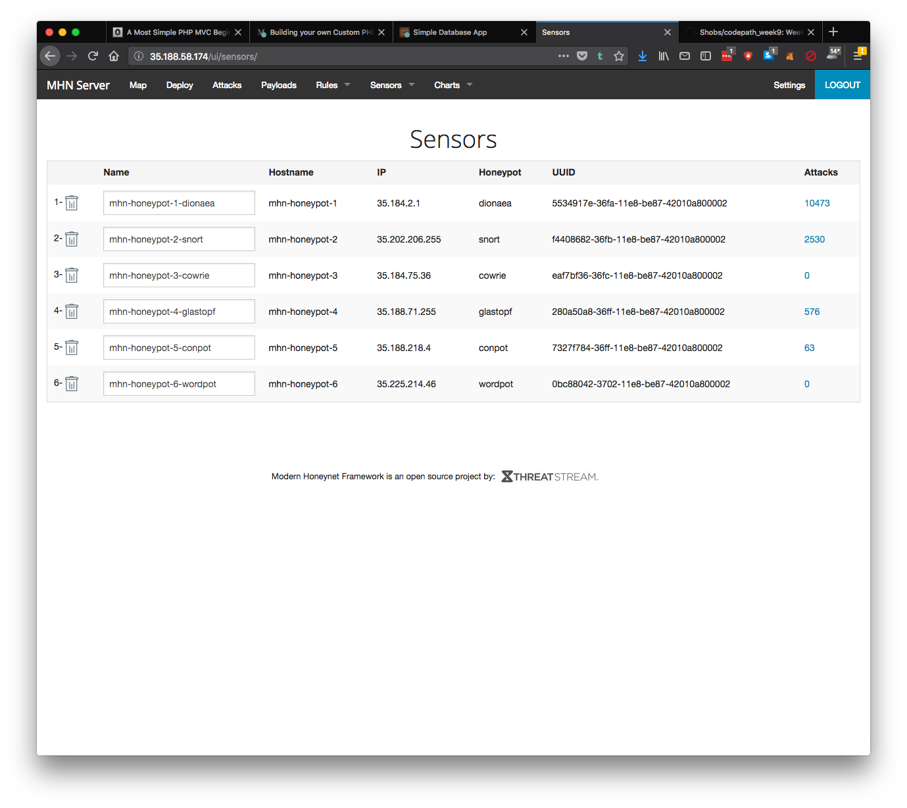

# Project 9 - Honeypot

Time spent: **11** hours spent in total

> Objective: Setup a honeypot and intercept some attempted attacks in the wild.

## Description

The project gave a step-by-step procedure to deploy a Dionaea honeypot and provided a guideline to deploy others.

I decided to deploy 5 other honeypot:
- snort
- cowrie
- glastopf
- conpot
- wordpot

## Issues encountered

The directions in the project were pretty straight forward and very helpful.  

The only issue I encountered was to actually deploy a honeypot the first time around since I couldn't access the admin panel on port 80 nor did I realize that there was an admin interface on that port.  It took me a little while and some googling to realize that I needed to access port 80 since the firewall rules for the admin interface only allowed for traffic on port 3000 and 10000.

Once that hurdle was over deploying extra honeypot was pretty straight forward.

## Summary

The total number of attacks and honeypot is as follow:

## Notes

Not sure if I set up cowrie and wordpot properly since there was no attack on them.

I also didn't catch any malwares or at least it didn't show up on the payload page.

Looking quickly over the data it seems that most of the attacks are from China, Russia and the US.

